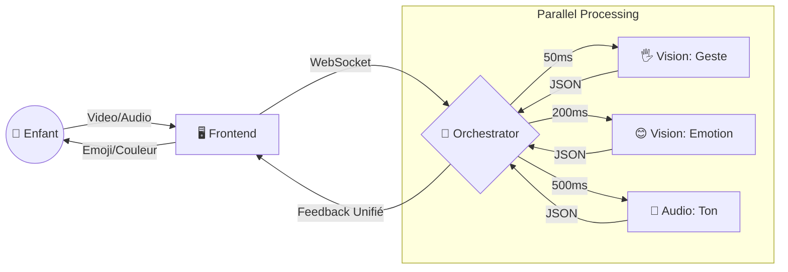

# HCI Evaluation: OmniSense - The Empathetic Mirror
**Focus: Outil d'Aide à la Reconnaissance Émotionnelle**
*(10 Slides Max)*

---

## Slide 1: Introduction & Problem Statement (1 min)

### Le Défi: Cécité Émotionnelle (Alexithymie)
Pour de nombreux enfants **autistes (TSA)**, décoder les expressions faciales ou moduler leur propre voix est un défi quotidien.

**La Solution: OmniSense**
Un "Miroir Magique" multimodal qui agit comme un **tuteur émotionnel temps-réel**.
- **Analyse:** Identifie objectivement l'émotion du visage et de la voix.
- **Feedback:** Renvoie un signal visuel simple (Emoji) pour valider l'expression.
- **Contrôle:** Permet l'interaction via Gestes (pour les profils non-verbaux).

---

## Slide 2: Architecture & Data Flow (1.5 min)

### Une Architecture Distribuée pour une Réponse "Temps Réel"

Pour qu'un enfant associe "Mon Sourire" = "Emoji Joyeux", la latence doit être imperceptible.

**Défi Technique:** Synchroniser 3 flux asynchrones pour un feedback cohérent.

---

## Slide 3: Pourquoi Évaluer l'HCI? (1 min)

### Critères Critiques pour la Neurodiversité

Dans ce contexte thérapeutique/éducatif, l'évaluation HCI n'est pas optionnelle :

1.  **Effectiveness (Précision):** Si l'enfant est triste mais l'IA dit "Joyeux", cela renforce une mauvaise association. Taux d'erreur toléré < 5%.
2.  **Efficiency (Latence):** Le feedback doit être immédiat (< 200ms) pour créer le lien de causalité neuronal.
3.  **Safety (Sécurité):** Aucune donnée biométrique (visage/voix) ne doit être stockée (Privacy by Design).

---

## Slide 4: Métriques & Performance (1 min)

### Mesurer l'Invisible

| Critère HCI | Métrique | Performance Actuelle | Impact Utilisateur (TSA) |
|-------------|----------|----------------------|--------------------------|
| **Latency** | Time-to-Feedback | **Vision: 50ms** | ✅ Feedback instantané, lien causal fort. |
| **Accuracy** | Emotions reconnues | **7 classes** | ✅ Suffisant pour émotions primaires (Joie, Colère...). |
| **Recovery** | Gestion d'erreur | **Lissage 5 frames** | ✅ Évite le clignotement d'emojis confus. |
| **Consistency**| Conflit Audio/Vidéo | **Fusion Logic** | ⚠️ Risque de confusion si voix et visage diffèrent. |

---

## Slide 5: Méthodes d'Évaluation Mixte (1 min)

### 1. Expert Analysis (Cognitive Walkthrough)
**Scénario:** "L'enfant essaie de mimer la colère."
- *Étape:* Froncer les sourcils.
- *Attente:* L'écran devient rouge + Emoji 😡.
- *Observation Expert:* Vérifier que le changement est fluide et sans ambiguïté.

### 2. User Participation (Observational)
**Protocole:** Observer les réactions non-verbales (Gaze Tracking).
- L'enfant regarde-t-il l'emoji (feedback) ou se regarde-t-il lui-même ?
- Y a-t-il des signes de frustration (latence perçue) ?

---

## Slide 6: Formative vs Summative (1 min)

### Une Conception Itérative Centrée Utilisateur

-   **Formative (Au début):**
    -   *Design:* Badges texte ("HAPPY").
    -   *Feedback Test:* Enfants ne lisent pas ou c'est trop lent.
    -   *Correction:* Remplacement par **Emojis géants animés** (Langage universel).

-   **Summative (Maintenant):**
    -   *Validation:* Test de performance en conditions réelles (bruit, lumière variable).
    -   *Résultat:* Le module "Audio" est parfois trop sensible au bruit ambiant (classe d'école) → Désactivable.

---

## Slide 7: Protocole de Test Utilisateur (1 min)

**Sujets:** 5 enfants TSA + 5 neurotypiques (Groupe contrôle).

**Tâches Évaluées:**
1.  **Imitation:** "Fais comme l'Emoji" (Validation moteur).
2.  **Reconnaissance:** "Fais un visage Joyeux" (L'IA valide-t-elle ?).
3.  **Communication:** "Utilise la main (👋) pour dire au revoir" (Substitution non-verbale).

**Métriques de Succès:**
-   Taux de succès de l'IA à valider l'intention de l'enfant.
-   Temps de réaction de l'enfant face au feedback.

---

## Slide 8: Considérations Éthiques Biométriques (1 min)

### Protéger les Utilisateurs Vulnérables

1.  **Transparence:** L'interface ne doit pas être une "Boîte Noire". L'enfant voit *pourquoi* l'IA réagit (Lignes du visage dessinées).
2.  **Over-Reliance:** Risque que l'enfant ne se fie qu'à la machine pour comprendre les émotions.
    -   *Mitigation:* Usage supervisé par un thérapeute/parent uniquement.
3.  **Biais Algorithmique:** DeepFace est-il entraîné sur des visages d'enfants neurodivergents ? (Risque de moindre précision).

---

## Slide 9: Résultats & Recommandations HCI (1 min)

### Bilan Actuel
-   **✅ Points Forts:** Feedback Visuel (Emojis) excellent pour l'apprentissage. Latence gestuelle (50ms) parfaite.
-   **⚠️ Points Faibles:** L'analyse vocale (500ms) traîne par rapport au visuel, créant une dissonance.

### Roadmap
1.  **Mode "École":** Filtrage du bruit de fond pour l'analyse audio.
2.  **Calibration Personnalisée:** Ajuster la sensibilité de détection (seuils) pour chaque enfant ("Hyper-expressif" vs "Hypo-expressif").

---

## Slide 10: Conclusion (0.5 min)

### Vers une IA Inclusive

OmniSense démontre qu'une architecture technique robuste (Micro-services) est nécessaire pour atteindre l'exigence HCI d'un public neurodivergent.

En transformant des signaux sociaux invisibles en feedback visuel tangible, nous créons plus qu'une interface : **un pont de communication.**

**Lien Projet:** https://eloquence-ai1.vercel.app

---
